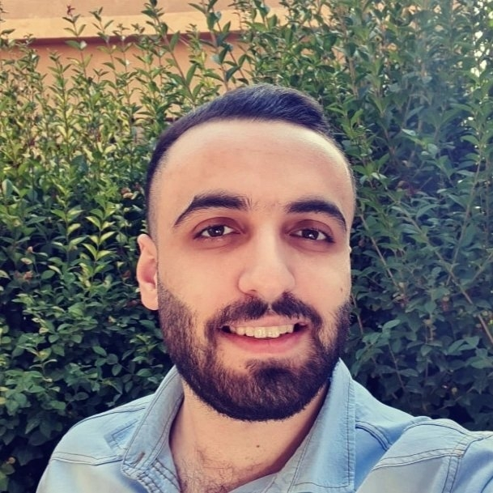

# Jawad Yazbek - Personal Portfolio

A modern, responsive, and multilingual portfolio website built with the latest web technologies. Featuring a seamless transition between English (LTR) and Arabic (RTL) layouts.



## 🚀 Features

- **Multilingual Support**: Fully localized in English and Arabic.
- **RTL/LTR Layout**: Dynamic layout switching that respects language direction.
- **Modern UI/UX**: Built with Tailwind CSS 4 and Framer Motion for smooth animations and a premium feel.
- **Responsive Design**: Optimized for all devices, from mobile phones to large desktops.
- **Functional Contact Form**: Integrated with Web3Forms for serverless email delivery.
- **Project Showcase**: Highlights key projects with detailed descriptions and tech stacks.

## 🛠️ Tech Stack

- **Framework**: [Next.js](https://nextjs.org/) (App Router)
- **Styling**: [Tailwind CSS 4](https://tailwindcss.com/)
- **Animations**: [Framer Motion](https://www.framer.com/motion/)
- **Icons**: [Lucide React](https://lucide.dev/)
- **Language**: [TypeScript](https://www.typescriptlang.org/)
- **Deployment**: [Vercel](https://vercel.com/)

## 📁 Project Structure

```text
src/
├── app/            # Next.js App Router pages and global styles
├── components/     # Reusable React components (Hero, About, Projects, etc.)
├── context/        # Language and Theme context providers
├── translations/   # Localization JSON files (EN/AR)
└── public/         # Static assets (images, icons)
```

## ⚙️ Getting Started

### Prerequisites

- Node.js 18.x or later
- npm or yarn

### Installation

1. Clone the repository:
   ```bash
   git clone https://github.com/JawadYzbk/jawadyz-portfolio.git
   ```

2. Install dependencies:
   ```bash
   npm install
   ```

3. Set up environment variables:
   Create a `.env.local` file and add your Web3Forms access key:
   ```env
   NEXT_PUBLIC_WEB3FORMS_ACCESS_KEY=your_access_key_here
   ```

4. Run the development server:
   ```bash
   npm run dev
   ```

5. Open [http://localhost:3000](http://localhost:3000) in your browser.

## 📝 License

This project is licensed under the MIT License - see the [LICENSE](LICENSE) file for details.

## 📧 Contact

Jawad Yazbek - [jawadyazbek@gmail.com](mailto:jawadyazbek@gmail.com)

Project Link: [https://github.com/JawadYzbk/jawadyz-portfolio](https://github.com/JawadYzbk/jawadyz-portfolio)
